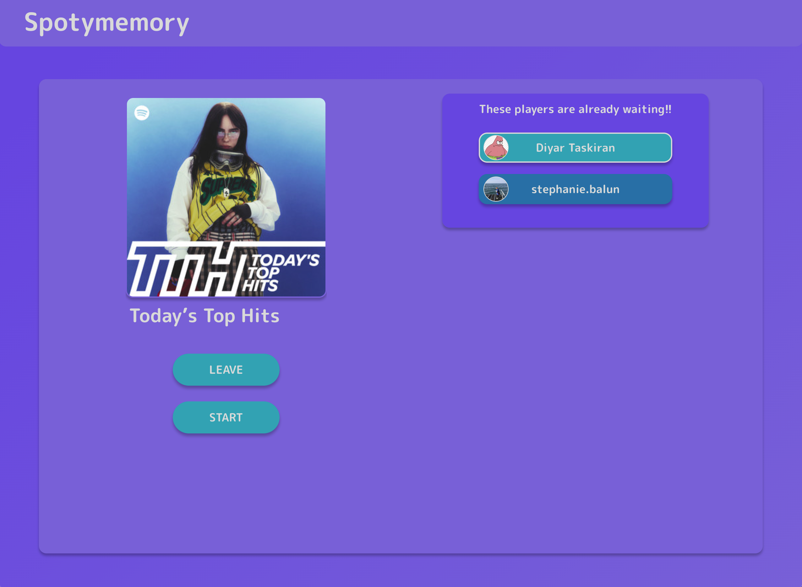

## Introduction

While music streaming services have transformed the listening experience of everybody over the past decade; they have also deteriorated the social aspects of music enjoyment. In the era of streaming, it is difficult to discover, share, and enjoy music with friends.

This project intends to provide a playful shared listening experience in the form of a Spotify based memory game. Memory is a game in which players take turns to collect points by matching pairs of face-down cards. In our game, Spotymemory, the cards represent elements of music, such as snippets of a song or album art, depending on the game mode.

Through this game, players have the chance to discover new music with friends. This game is also a great web application project for this course, as it takes advantage of the powerful Spotify API and presents a broad range of design possibilities.

This is the front-end part of our implementation – the corresponding back-end can be found [here](https://github.com/sopra-fs24-group-28/spotify-memory-server). Find the application currently deployed [here](https://sopra-fs24-group-28-client.oa.r.appspot.com/login).

This application was developed as part of the FS24 – Software Engineering Lab (SoPra) taught by Prof. Dr. Thomas Fritz. [More information](https://hasel.dev/teachings/fs24-sopra/).

## Technologies

The client is developed using React with TypeScript and JavaScript.

The application is deployed on Google Cloud. To ensure a smooth in-game experience, we utilized a REST interface for basic communication between the front and backend, while incorporating STOMP WebSockets for more seamless and efficient real-time interactions.

## High-level Components

The [Login](https://github.com/sopra-fs24-group-28/spotify-memory-client/blob/main/src/components/views/Login.tsx) allows users to access the app using their Spotify credentials though OAuth. A successful login requires a Spotify Premium subscription and linking the Spotify account to a Spotify API App.

The [LobbyOverview](https://github.com/sopra-fs24-group-28/spotify-memory-client/blob/main/src/components/views/LobbyOverview.tsx) allows the users to either create a new lobby or join an existing one. When creating a new lobby, the user can define various game parameters in [the customization view](https://github.com/sopra-fs24-group-28/spotify-memory-client/blob/main/src/components/views/CustomizeGameParameter.tsx) such as the game mode, the number of cards, number of decks, and more. Moreover, the user can choose one of their personal playlists to serve as the basic game contents. Note that a user can only create a lobby if they have a Spotify playlist in their library. 

Upon creation, the lobby becomes public and can be joined by other players form the [LobbyOverview](https://github.com/sopra-fs24-group-28/spotify-memory-client/blob/main/src/components/views/LobbyOverview.tsx). All players who join are directed to the [lobby waiting room](https://github.com/sopra-fs24-group-28/spotify-memory-client/blob/main/src/components/views/LobbyWaitingRoom.tsx) until the host decides to start the game.

In the primary [GameScreen](https://github.com/sopra-fs24-group-28/spotify-memory-client/blob/main/src/components/views/GameScreen.tsx) users are faced with a deck of face down cards which they can interact with (during their turns). They also see a turn timer, as well as a scoreboard. The active player can select a set of cards, consume the respective contents (depending on the game mode, music or cover art) and try to match pairs. All observing players can consume the same content at the same time.

The game ends when all set of cards are correctly picked. Players are redirected to the [GameOverScreen](https://github.com/sopra-fs24-group-28/spotify-memory-client/blob/main/src/components/views/LobbyOverview.tsx), form where the host can restart the game.

## Launch & Deployment

Before running the app, install dependencies using `npm install`.

The app can be launched in development mode locally using `npm run dev` (default: localhost:3000).

To create a build of the app for production, run `npm run build`. For cloud deployment, see our workflow [here](https://github.com/sopra-fs24-group-28/spotify-memory-client/blob/599e219ac15e7ce4cb23da2230e03a768d94d00c/.github/workflows/main.yml). 

If any errors are encountered, ensure that you comply with the troubleshooting steps below. 
<ol>
  <li>Disable VPN</li>
  <li>Disable Ad Blockers</li>
  <li>Allow Popups</li>
  <li>Disable Tracking Preventions</li>
  <li>Select Playlist available in local markets</li>
</ol>

## Illustrations

    <h3>Login page</h3>
    
Users can log in using their Spotify credentials

    

    <h3>Lobby overview</h3>
    
From the overview, users can join existing lobbies or create a new one

    

    <h3>Lobby waiting room </h3>
    
Players are gathered in a waiting room until the host starts the game

    

    <h3>Main game screen</h3>
    
Memory board game, with turn indicator and scoreboard. 
      Active players can select cards which are then displayed for all players.

    

## Roadmap

- Add further game modes, such as:
  - Matching different songs from the same artist
  - Matching different songs from the same genre
- Create a global leaderboard
- Submit Quota Extension request (takes about six weeks)

## Authors and Acknowledgment

SoPra FS24 – Group 28 consists
of [Diyar Taskiran](https://github.com/DTaskiran), [Elias Müller](https://github.com/EliasWJMuller),
[Henry Kim](https://github.com/hs-kim1990), [Niklas Schmidt](https://github.com/niklasschm1dt)
and [Nicolas Schuler](https://github.com/NicSchuler).

We want to thank our teaching assistant [Cedric von Rauscher](https://github.com/cedric-vr) for his guidance during the project.

## License

Apache-2.0
